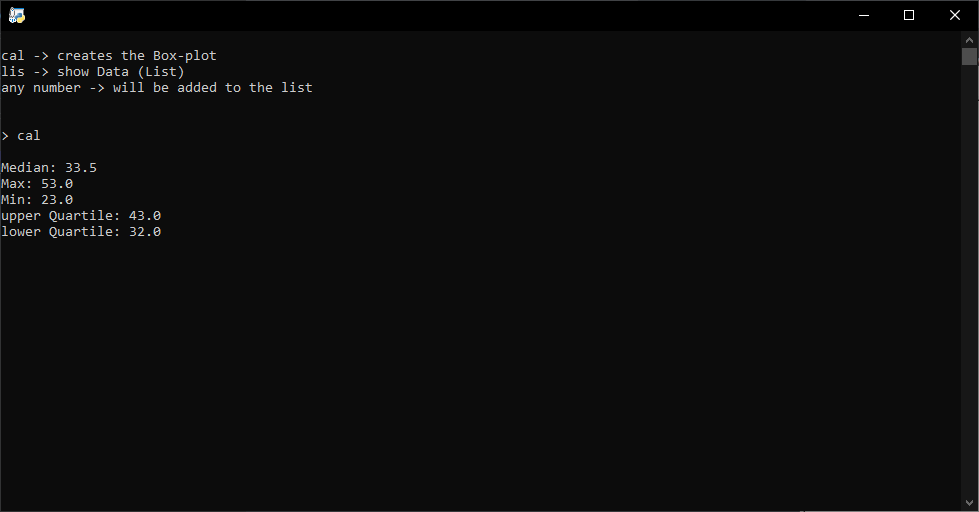
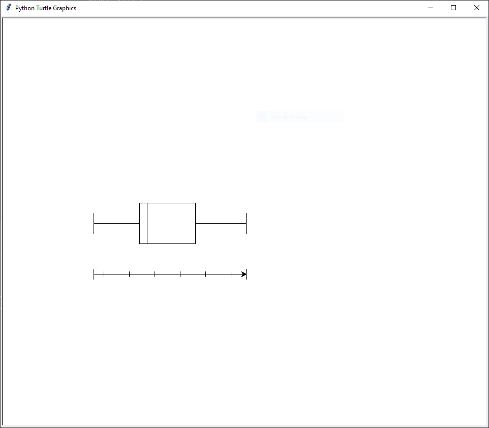

# Box-Plot Maker

## Languages

|[English](#English)|[German](#Deutsch)|[Russian](#Русский)|
|:--:|:--:|:--:|

### **English**

---

#### **Overview**

This Program will create a Box-Plot Diagramm with the Module Turtle.
You can add Data inside the input.txt File.
when running the Main Code, it won't only "Draw" the Diagram but also gives important information:  

* Median
* Max Number
* Min Number
* Upper Quartile
* Lower Quartile

##### **Instructions**

1. Download the Repository as a Zip-File
2. Unzip the Zip-File
3. remove the example code in input.txt, add your own Data set and save (atleast 10 Numbers)
4. run Box-Plot_Maker.py

##### **Commands**

* cal -> creates a Box-Plot with the given Data
* lis -> prints out the Array
* any Number -> adds the given number to the Array

||
|:--:|
|Output|

||
|:--:|
|Diagram|

---

### **Deutsch**

---

#### **Überblick**

Dieser Programm erstellt ein Box-Plot-Diagramm mit dem Modul Turtle.
Sie können Daten in die Datei input.txt einfügen.
wenn der Main Code ausgeführt wird, wird er nicht nur das Diagramm "zeichnen", sondern auch wichtige Informationen liefern:

* mittlere Zahl
* grösste Zahl
* kleinste Zahl
* oberes Quartil
* unteres Quartil

##### **Einleitung**

1. herunterladet dieses Repository als Zip-Datei
2. entpackt das Zip-Datei
3. löscht das beispiel im input.txt, fügt eigene Daten hinein und speichert (Minimum 10 Zahlen)
4. führt Box-Plot_Maker.py aus

##### **Befehle**

* cal -> kreirt das Diagramm mit gegebenen Daten
* lis -> druckt das Array aus
* irgendeine Nummer -> gibt die gegebene Zahl zu Array

||
|:--:|
|Ausgabe|

||
|:--:|
|Diagramm|

---

### **Русский**

---

#### **Обзор**

coming soon

##### **Инструкции**

coming soon

##### **Команды**

* cal -> создает коробчатую диаграмму с заданными данными
* lis -> распечатывает массив
* любой Номер -> добавляет заданное число в массив

---
